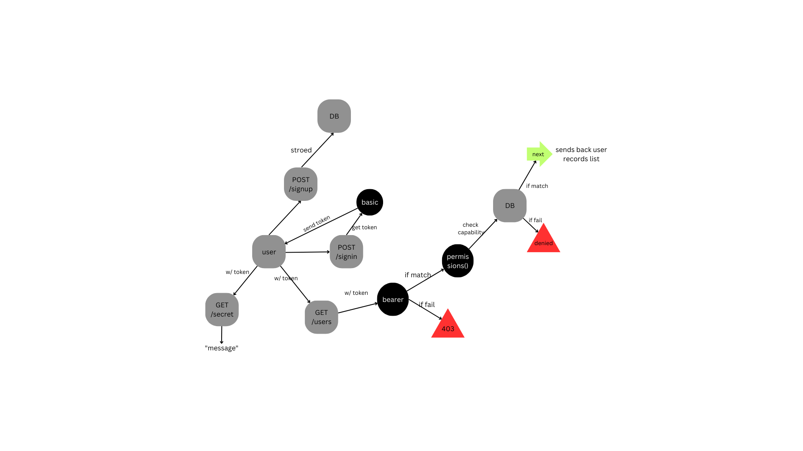

# auth-api

Being able to login is great. But controlling access at a more granular level is vital to creating a scalable system. In this lab, you will implement Role Based Access Control (RBAC) using an Access Control List (ACL), allowing to not only restrict access to routes for valid users, but also based on the individual permissions we give each user.

## UML for This Project

## [Render](https://api-with-auth-3twa.onrender.com)

## Getting Started

1. To start, clone the repo to your local machine and `npm -i` to install all dependencies
2. Change the file `.env.sample` to `.env` and input your values
3. This should be a fully functional server with authentication/authorization implemented. To initiate a test, go to Thunder Client and type `http:localhost:<your PORT>/food`, you should see an empty array with status code 200
4. To further customize this server, feel free to add your own models and change the api endpoints in `routes`. Note that `v1` are for unauthenticated users, and `v2` are for authenticated users
5. To add your own models: go to src--> models --> index.js and inport your own models there
